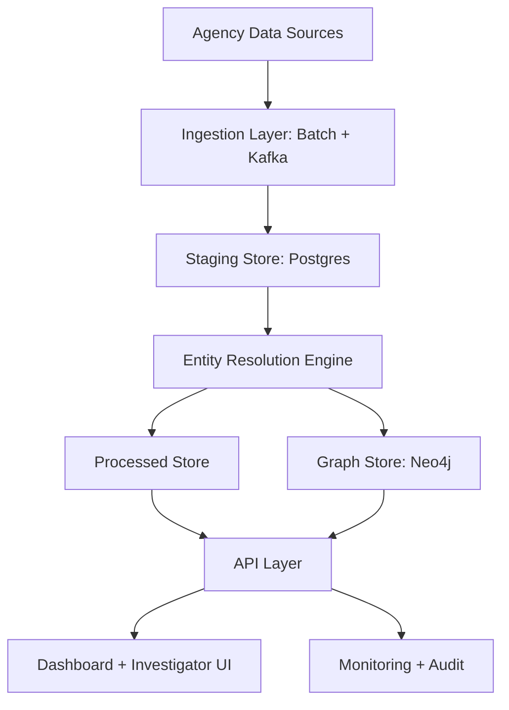

# OmniGraph Production Roadmap

## Scope
This roadmap turns OmniGraph from demo to production in phased increments. It is grounded in the current repo implementation and identifies what is already completed versus what still needs delivery.

## Current State (Implemented)
- Cross-source entity resolution pipeline in Python.
- Batch processing over generated multi-department data.
- Graph load and risk queries in Neo4j.
- Dashboard and API integration.
- Optional streaming scaffold (Kafka producer/consumer + optional compose stack).

## Current Gaps
- API robustness for CSV parsing and large-result pagination.
- Startup reliability and deterministic failure handling.
- Security hardening (authn/authz, secrets management, TLS).
- Governance and privacy controls (lineage, auditability, minimization).
- Operational readiness (observability, CI/CD, incident runbooks).

## Phase Plan

### Phase 1: MVP Hardening (Now)
- Harden API parsing and pagination.
- Add startup fail-fast behavior and deterministic data bootstrap.
- Lock core baseline tests for resolution/API/graph query outputs.

Deliverables:
- Robust CSV parser integration in API.
- Paginated entities, source mapping, and anomalies endpoints.
- Run script with step-level exit code checks.

### Phase 2: Pilot Readiness
- Add authentication and role-based authorization for API and UI.
- Move credentials into environment-based secrets.
- Add structured logging and basic metrics.
- Add explainability output for match decisions.

Deliverables:
- Auth gateway and role policies.
- `.env`/vault-based secret flow.
- Prometheus/Grafana/ELK integration baseline.
- Resolution audit fields and decision reasons.

### Phase 3: Scale and Reliability
- Replace CSV runtime reads with database-backed serving.
- Add streaming ingestion path with Kafka + consumers feeding staging tables.
- Add HA posture for graph and API services.

Deliverables:
- Postgres-backed API query layer.
- Kafka-to-staging ingestion service.
- Backup/restore and failover runbooks.

### Phase 4: National Rollout
- Agency onboarding templates and data contracts.
- Compliance packs and policy controls.
- SRE operating model and SLA enforcement.

Deliverables:
- Standard onboarding kit.
- Compliance evidence + audit reports.
- 24x7 operations playbook.

## Target Architecture

## Immediate Next Execution Items
1. Completed: Add authn/authz middleware and role claims in API.
2. Completed: Introduce secure `.env` model and remove hardcoded credentials from compose/scripts.
3. Completed in API + graph smoke scripts: Add integration tests for:
   - resolution output consistency
   - API pagination correctness
   - graph load and risk query sanity checks
4. Completed (feature-flag phase): Start migration from CSV runtime reads to Postgres tables for API endpoints.

## KPI Targets
- API p95 response time under 200ms for paginated endpoints.
- Resolution batch completion for 30k+ records under 10 minutes on baseline hardware.
- Startup script deterministic success/failure (no partial-success silent failures).
- Zero unhandled parser failures from quoted CSV fields.
